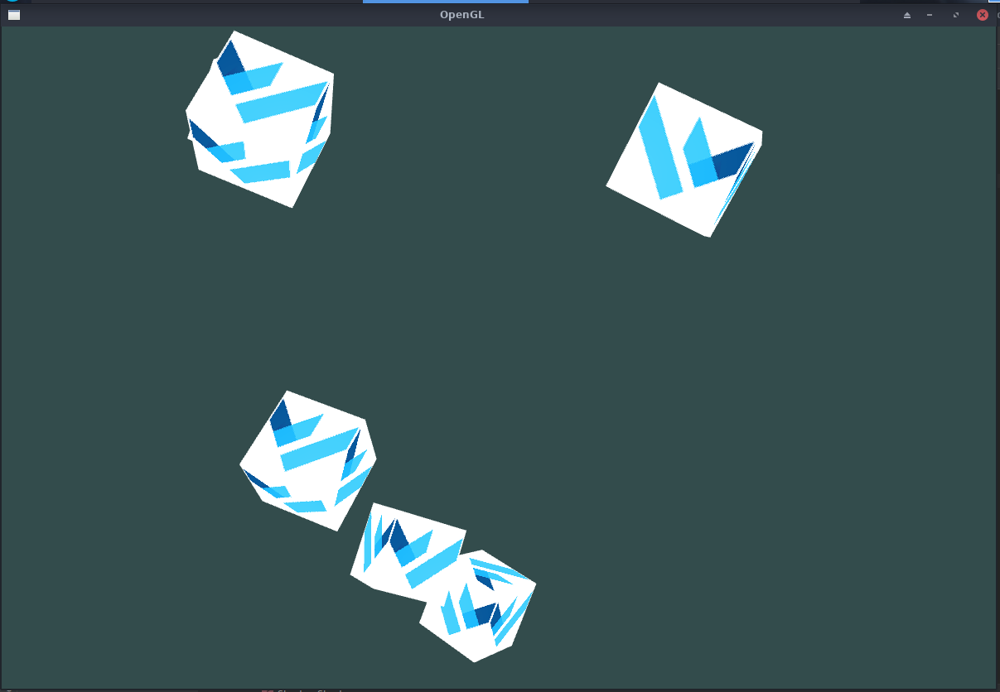
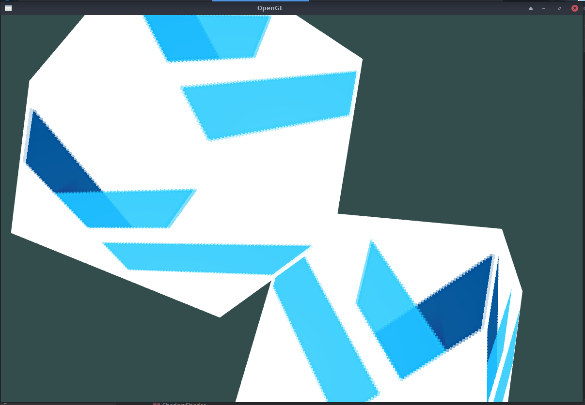

# opengl_glfw01
  跟随LearnOpenGL CN入门篇写的程序
  
  
  
## 笔记
  * glm::normalize
    * 把向量规范成单位向量
  * glm::cross
    * 叉乘
    * 两个向量叉乘得到垂直与它们构成的平面的向量
  * deltaTime(△time)
    * 增量时间，上一帧的绘制时间
    * 使得变换更加平滑
  * 相机
    * pitch: 俯仰角
    * yaw: 偏航角
    * roll: 翻滚角(暂时未用到)
  * pitch以及yaw的计算
    ```
        //    俯仰角计算                  偏航角计算
        //        y                         z
        //        |     /                   |     /
        //        |    /|                   |    /|
        //        |   / |                   |   / |
        //        |  /  | sin(pitch)        |  /  | sin(yaw)
        //        | /   |                   | /   |
        //        |/)pit|                   |/)yaw|
        // ----------------- x/z     ----------------- x
        //        |   cos(pitch)            |   cos(yaw)
        //        |                         |
        //        |                         |
        //        |                         |
        front.x = glm::cos(glm::radians(pitch)) * glm::cos(glm::radians(yaw));
        front.y = glm::sin(glm::radians(pitch));
        front.z = glm::cos(glm::radians(pitch)) * glm::sin(glm::radians(yaw));
    ```