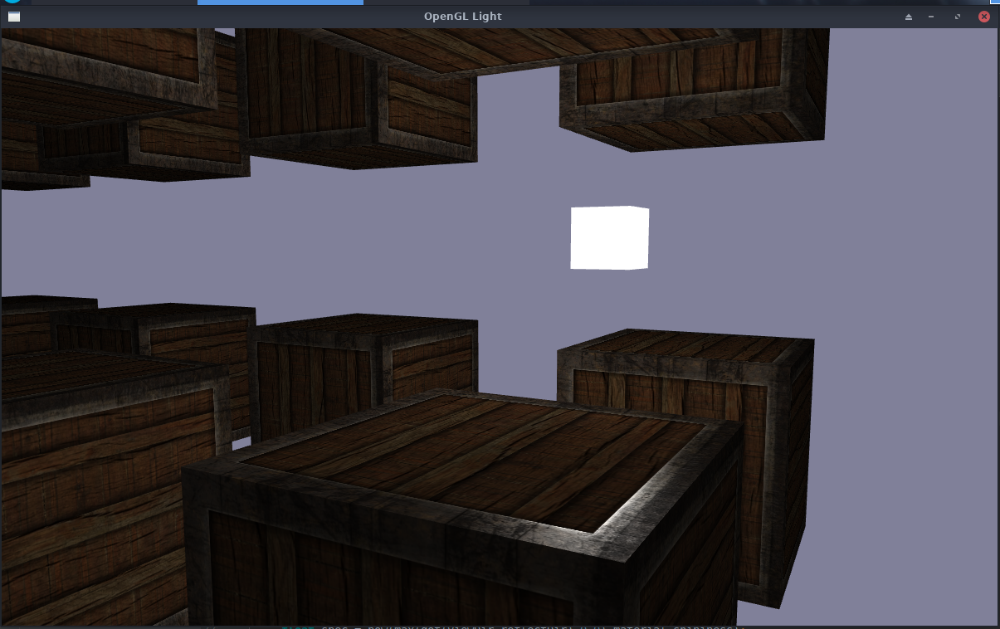

# opengl_glfw02
  OpenGL 光照学习
  
  
  
## 笔记
  * 冯氏光照模型
    * 环境光照(ambient)
    * 漫反射(diffuse)
    * 镜面反射(specular)
    * 环境光照
      * 光源乘上环境因子
        ```c
          float ambientStrength = 0.1;
          vec3 ambient = ambientStrength * lightColor;
        ```
    * 漫反射
      * 给顶点添加法向量
      * 获得片段在世界中的位置 (顶点着色器)
        ```c
          FragPos = vec3(modelMatrix * vec4(aPos ,1.0));
        ```
      * 根据片段和光源位置计算向量差
        ```c
        vec3 lightDir = normalize(lightPos - FragPos);
        ```
      * 法向量和上一步的结果进行点乘求对光源的影响
        ```c
          float diff = max(dot(norm ,lightDir) ,0.0);
        ```
      * 乘上光源
        ```c
          vec3 diffuse = diff * lightColor;
        ```
    * 镜面反射
      * 定义镜面反射强度
      * 计算视线向量
        ```c
          vec3 viewDir = normalize(viewPos - FragPos);
        ```
      * 计算反射光向量
        ```c
          vec3 reflectDir = reflect(-lightDir , norm);
        ```
      * 计算视线位置和反射位置的点乘，再定义反光度(32)
        ```c
          float spec = pow(max(dot(viewDir,reflectDir),0.0),32);
        ```
      * 根据反射强度，反光度，光照颜色计算镜面分量
        ```c
          vec3 specular = specularStrangrh * spec * lightColor;
        ```
    * 最终颜色
      * 环境光照加上漫反射和镜面反射的分量乘上物体颜色
        ```c
          vec3 result = (diffuse + ambient + specular) * objectColor;
        ```
  * 投光物
    * 定向光源：直接指定光的方向，不需要光源位置
    * 点光源：向四周发散光，但是会随着距离衰减
      * 衰减公式
        > 1.0/(常数项+一次项*距离+二次项*距离*距离)
        
        | 距离    | 常数项 | 一次项  | 二次项  |
        | ------ | ------ | ------ | ------ |
        | 7	     | 1.0    |	0.7	   | 1.8      |
        | 13     | 1.0    |	0.35   | 0.44     |
        | 2	     | 1.0    |	0.22   | 0.20     |
        | 32     | 1.0    |	0.14   | 0.07     |
        | 50     | 1.0    |	0.09   | 0.032    |
        | 65     | 1.0    |	0.07   | 0.017    |
        | 100    | 1.0    | 0.045  | 0.0075   |
        | 160    | 1.0    | 0.027  | 0.0028   |
        | 200    | 1.0    | 0.022  | 0.0019   |
        | 325    | 1.0    | 0.014  | 0.0007   |
        | 600    | 1.0    | 0.007  | 0.0002   |
        | 3250   | 1.0    |	0.0014 | 0.000007 |